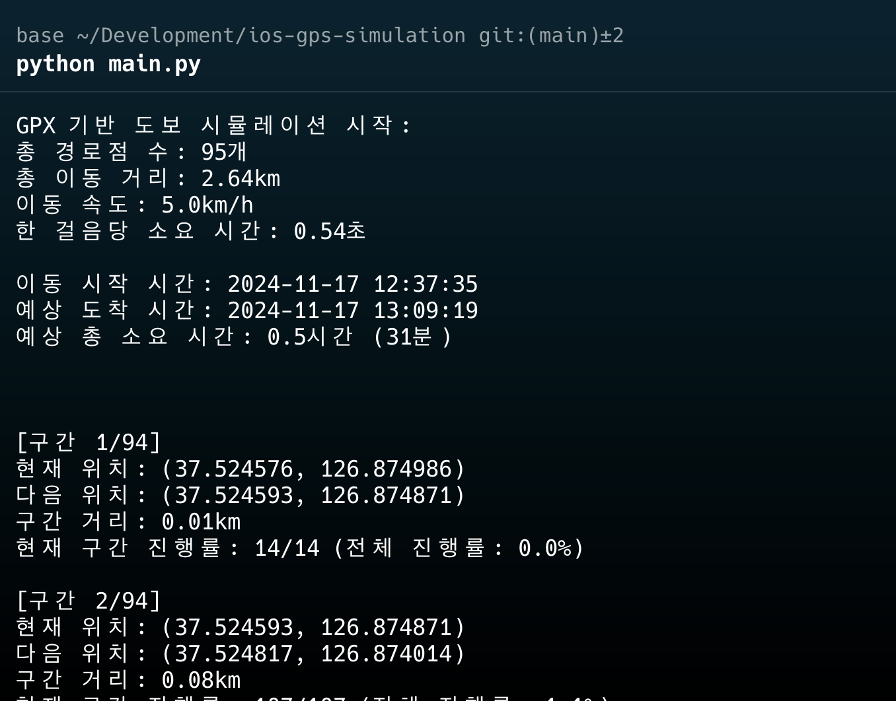

# iOS 위치 시뮬레이션 도구

이 프로젝트는 iOS 기기의 GPS 위치를 시뮬레이션하는 Python 도구입니다. pymobiledevice3 라이브러리를 사용하여 iOS 기기와 통신하고 위치 데이터를 조작할 수 있습니다.



## Running

```bash
pymobiledevice3 usbmux list

pymobiledevice3 mounter auto-mount

# [선택1] 터널링 시작 (유선)
sudo python3 -m pymobiledevice3 remote tunneld

# [선택2] 터널링 시작 (WiFi)
sudo python3 -m pymobiledevice3 remote start-tunnel -t wifi

# 터널링 명령어 실행 후 출력되는 메시지에서 RSD Address 와 RSD Port 정보를 확인합니다.
"""
2024-11-17 00:24:35 Bradui-iMac.local pymobiledevice3.cli.remote[17455] INFO tunnel created
Identifier: #########
Interface: utun8
Protocol: TunnelProtocol.QUIC
RSD Address: fdc7:9332:a7b::1
RSD Port: 58536
Use the follow connection option:
--rsd fdc7:9332:a7b::1 58536
"""
```

```bash
# main.py 파일에서 rsd 와 port 를 위의 정보로 설정합니다.
python main.py fdc7:9332:a7b::1 58536
```

## 작동 원리

### pymobiledevice3 통신 구조

1. **usbmuxd 연결**
   - iOS 기기와의 USB/Wi-Fi 통신을 담당하는 데몬
   - 기기 탐지 및 TCP 포트 프록시 역할 수행

2. **RemoteXPC 터널링**
   - iOS 17+ 버전에서는 RemoteXPC 프로토콜을 통해 기기와 통신
   - HTTP/2와 XPC 메시지를 사용하여 효율적인 통신 구현
   - 개발자 서비스 접근을 위한 인증된 터널 생성

3. **DVT(Developer Tools) 서비스**
   - DTServiceHub를 통해 iOS 기기의 개발자 기능에 접근
   - 위치 시뮬레이션 등 다양한 개발자 도구 기능 제공

### WalkingSimulator 클래스 구현

1. **초기화 및 연결**
```python
async def create(cls, host, port, walking_speed_kmh=4.0):
    # RemoteXPC 연결 설정
    rsd = RemoteServiceDiscoveryService((host, port))
    await rsd.connect()

    # DVT 서비스 초기화
    dvt = DvtSecureSocketProxyService(rsd)
    dvt.perform_handshake()
```

2. **위치 시뮬레이션 기능**
- 단일 경로 이동: `simulate_walking()`
- 다중 경유지 이동: `simulate_walking_multiple_points()`
- GPX 파일 기반 이동: `simulate_walking_with_gpx()`

3. **이동 계산 로직**
```python
def generate_intermediate_points(self, start_pos, end_pos):
    # 시작점과 끝점 사이의 중간 지점들을 생성
    # 설정된 걸음 속도에 따라 적절한 간격으로 위치 포인트 생성
```

## 주요 기능

- 실제 걷는 속도를 시뮬레이션 (기본 4km/h)
- GPX 파일을 통한 경로 시뮬레이션
- 다중 경유지 지원
- 실시간 진행 상황 모니터링
- 예상 소요 시간 및 거리 계산

## 사용 예시

```python
async def main():
    # 시뮬레이터 인스턴스 생성
    simulator = await WalkingSimulator.create(
        host='fdc7:9332:a7b::1',
        port=58536,
        walking_speed_kmh=5.0
    )

    # GPX 파일 기반 시뮬레이션
    simulator.simulate_walking_with_gpx('route.gpx')

    # 또는 수동으로 경유지 설정
    WAYPOINTS = [
        (37.5240, 126.8767),  # 시작점
        (37.5264, 126.8654),  # 경유지1
        (37.5277, 126.8738)   # 도착점
    ]
    simulator.simulate_walking_multiple_points(WAYPOINTS)
```

## 기술적 세부사항

- **위치 업데이트 간격**: 걸음 속도에 따라 자동 계산
  ```python
  steps_per_km = 1333  # 1km당 평균 걸음 수 (0.75m 보폭 기준)
  steps_per_hour = steps_per_km * walking_speed_kmh
  update_interval = 1 / (steps_per_hour / 3600)
  ```

- **거리 계산**: Haversine 공식 사용
  ```python
  def calculate_distance(self, start_pos, end_pos):
      # 두 지점 간의 실제 지구 표면 거리 계산
      R = 6371  # 지구의 반경 (km)
      # ... Haversine 공식 구현 ...
  ```

## 요구사항

- Python 3.7+
- pymobiledevice3 라이브러리
- iOS 기기와의 RemoteXPC 터널 연결
- (선택) GPX 파일 (경로 데이터)